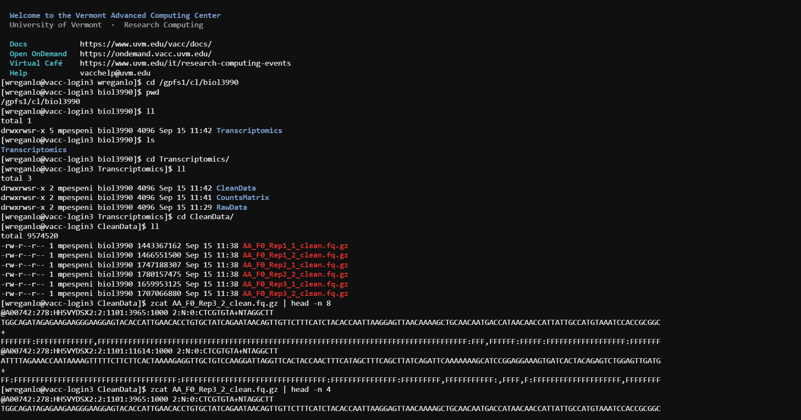
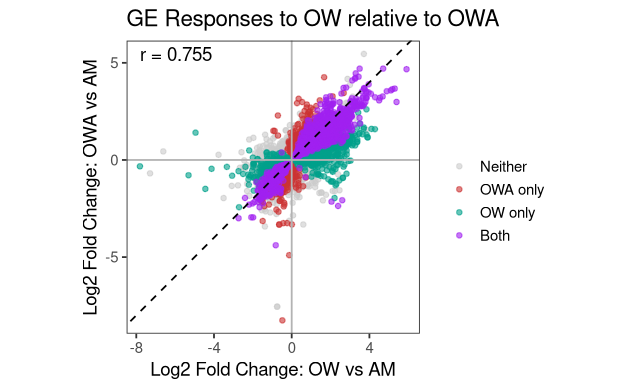

# Transcriptomics Notebook

**Course:** Intro to Ecological Genomics - Fall 2026

**Name:** Walt Regan-Loomis

------------------------------------------------------------------------

## 9.15.2026 - Setting up lab notebook and learning markdown

-   Setting up transcriptomics notebook

-   Learn how to take notes in markdown

-   Push notes to github

**Working Directory**

`/gpfs1/home/w/r/wreganlo/eco_genomics_2026/transcriptomics`

**Input Files:**

`none`

**Output Files:**

`/gpfs1/home/w/r/wreganlo/eco_genomics_2026/transcriptomics/transcriptomics_notebook.md`

**Programs and dependencies:**

-   `R version 4.5.1`

-   `R-Studio`

**Scripts:**

`none`

**Code:**

``` r
print("Hello World")
```

**Table:**

| Col1 | Col2 | Col3 |
|------|------|------|
|      |      |      |
|      |      |      |
|      |      |      |

**Image:**

{width="360"}

**Notes / Observations:**

-   Very nice graph/ interpretation

**Next Steps:**

Lets dive into project!

------------------------------------------------------------------------

## 9.17.2026 - introduce study system:

**Working Directory**

`/gpfs1/home/w/r/wreganlo/eco_genomics_2026/transcriptomics`

**Input Files:**

`none`

**Output Files:**

`/gpfs1/home/w/r/wreganlo/eco_genomics_2026/transcriptomics/transcriptomics_notebook.md`

**Programs and dependencies:**

-   `R version 4.5.1`

-   `R-Studio`

**Scripts:**

`none`

**Code:**

```         
cd /gpfs1/cl/biol3990 #change directory
ll #look in directory
zcat #un cat something (open zip)
-n #number of lines
head #number of lines from the top you want to see
wc -l #number of lines in file (word count)
```

**Image:**



**Notes / Observations:**

-   

**Next Steps:**

------------------------------------------------------------------------

## 9.22.2026 - Day 3 of Transcriptomics

**Working Directory**

`/gpfs1/home/w/r/wreganlo/eco_genomics_2026/transcriptomics`

**Input Files:**

`none`

**Output Files:**

`/gpfs1/home/w/r/wreganlo/eco_genomics_2026/transcriptomics/transcriptomics_notebook.md`

**Programs and dependencies:**

-   `R version 4.5.1`

-   `R-Studio`

**Scripts:**

`none`

**Code:**

```{r}
git status
git add .gitignore
git commit -m "Ignore results directory"
git push

touch ./mydata/test.txt
git status

#General Flow:
1. git pull
2. Do work
3. git status
4. git add .
5. git commit -m "meaningful message"
6. git push

#Diagnosing:
git status
git branch
git remote -v


```

**Notes:**

-   Today we set up our r working environment and copied some data.

-   We started looking at the data and exploring it with the commands mean and made a histogram to look at how the reads turned out (looking a frequency)

-   We then defined our model and started working with DESeq2

-   After that we transformed the data a bit and made a cluster tree to look for outliers

-   Then we made a PCA to visualize global gene expression patterns

    -   The PCAs look specifically at F0, F2, F4, and F11

    -   Arranged all togehter

    -   Saved them

**Photos:**


------------------------------------------------------------------------

## 9.24.2026 - Transcriptomics Day 4

-   Went over basic R things and then spent a little time messing around with salmon file

**Working Directory**

`/gpfs1/home/w/r/wreganlo/projects/eco_genomics_2026/transcriptomics`

**Input Files:**

`none`

**Output Files:**

`/gpfs1/home/w/r/wreganlo/eco_genomics_2026/transcriptomics/transcriptomics_notebook.md`

**Programs and dependencies:**

-   `R version 4.5.1`

-   `R-Studio`

**Scripts:**

`(.packages()) #shows loaded packages`

**Code:**

``` r
x <- 5
students <- data.frame( #makes data frame
  name = c("A", "B", "C"), #c() combines everything in ()
  height = c(62,68, 72)
)

head(students) #shows preview
class(students) #shows its a data frame
str(students) #types of data, chr = character num = number

students$name[1] #read me the first entry of "name: column
students[1,2] #look at (column,row)
```

------------------------------------------------------------------------

## 9.29.2026 - Transcriptomics Day 5 (4)

-   Spent more time with the salmon file

**Working Directory**

`/gpfs1/home/w/r/wreganlo/projects/eco_genomics_2026/transcriptomics`

**Input Files:**

`none`

**Output Files:**

`/gpfs1/home/w/r/wreganlo/eco_genomics_2026/transcriptomics/transcriptomics_notebook.md`

**Programs and dependencies:**

-   `R version 4.5.1`

-   `R-Studio`

**Code:**

Take a look at: `/gpfs1/home/w/r/wreganlo/eco_genomics_2026/transcriptomics/myscripts/9.29.26_AHUD_DESEQpt2.R`

------------------------------------------------------------------------

## 10.1.2026 - Transcriptomics Day 6 (Still Day 4 Tutorial)

-   Spent final time coding with the class on the salmon file

**Working Directory**

`/gpfs1/home/w/r/wreganlo/projects/eco_genomics_2026/transcriptomics`

**Input Files:**

\~/projects/eco_genomics_2026/transcriptomics/mydata/salmon.isoform.counts.matrix.filteredAssembly

\~/projects/eco_genomics_2026/transcriptomics/mydata/ahud_samples_R.txt

**Output Files:**

`/gpfs1/home/w/r/wreganlo/eco_genomics_2026/transcriptomics/transcriptomics_notebook.md`

**Programs and dependencies:**

-   `R version 4.5.1`

-   `R-Studio`

**Code:**

Take a look at: `/gpfs1/home/w/r/wreganlo/eco_genomics_2026/transcriptomics/myscripts/9.29.26_AHUD_DESEQpt2.R`

**Images:**



------------------------------------------------------------------------
